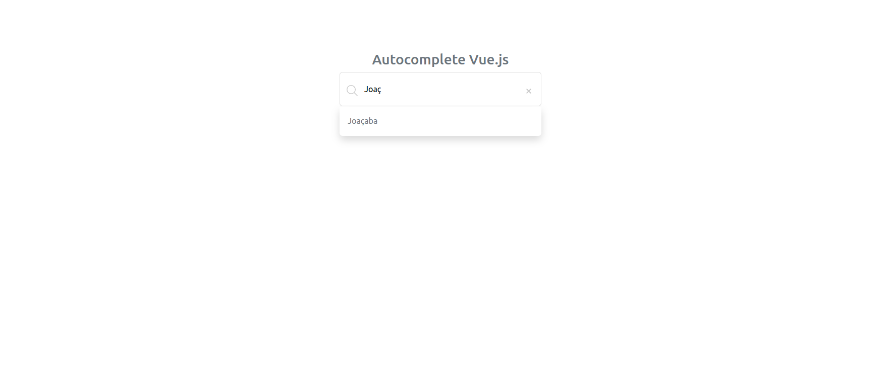

<h1 align="center"> Autocomplete Search Vue.js </h1>

<p align="center">
  Projeto de teste para campo de pesquisa com sugestões automáticas de acordo com as palavras-chaves inseridas.
</p>

<br>

<p align="center">
  
</p>

## 🚀 Tecnologias

Esse projeto foi desenvolvido com as seguintes tecnologias:

- [Vue.js](https://vuejs.org/)
- [Json Server](https://www.npmjs.com/package/json-server)
- [Axios](https://axios-http.com/ptbr/)


<h1 align="center"> Setup Front-end & Back-end</h1>

## 🔥 Front-end

Instale as dependências do projeto:

```
npm install
```

Rode a aplicação:

```
npm run dev
```

ou

```
npm run build
```

## 🔥 Back-end


```
cd db
json-server --watch api.json
```

<br /><br /><br />

<h4 align="center">
 
  <br />
  Feito com ♥ no Ubuntu 22.04 LTS
</h1>